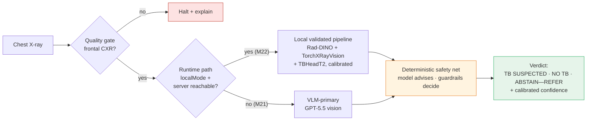
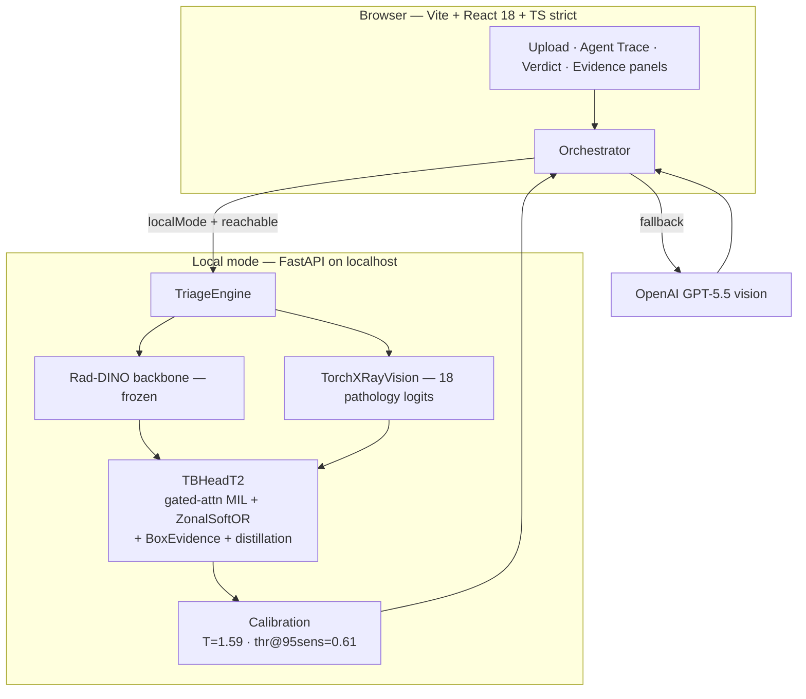
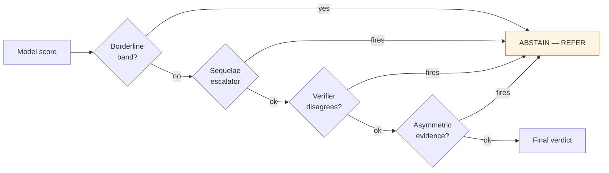
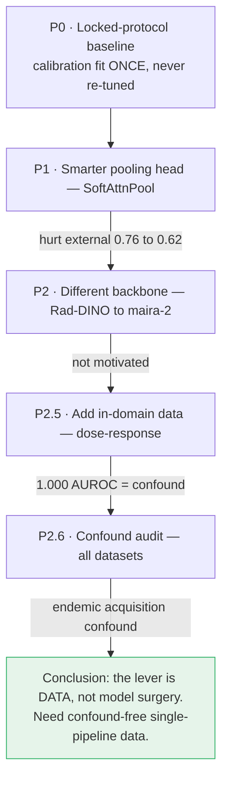

<div align="center">

# TB-CXR-Triage · Pakistan

### An AI-native tuberculosis chest-X-ray triage system — built to report the *honest* number, not the flattering one.

[](./LICENSE)
[](#%EF%B8%8F-not-a-medical-device)
[](#%EF%B8%8F-not-a-medical-device)
[](#-results-the-honest-numbers)
[](#development)
[](https://www.typescriptlang.org/)

**Tuberculosis · Chest X-ray (CXR) · Triage · Domain generalization · Rad-DINO · TorchXRayVision · Pakistan external validation**

</div>

---

> ## ⚠️ Not a medical device
> This is a **research preview for engineering and research education**. It is **not** a medical
> device, is **not** cleared by any regulator, and **must not** be used for diagnosis or any
> clinical decision. Reported metrics are against **radiographic** labels on open datasets, **not
> bacteriologically confirmed** TB, and **do not transfer unchanged to a new hospital**. A real
> screening deployment requires on-site re-validation and re-calibration on locally labelled data,
> reported with confidence intervals. WHO's 90% sensitivity / 70% specificity target is a **floor to
> aspire to, not a claim made here.**

---

## What this is — and why it's different

Most TB-CXR demos lead with a big in-distribution AUROC. This project leads with the number that
actually matters for a screening tool: **how it does on a hospital it has never seen.** On a held-out
**Pakistani cohort of 3,008 films, the model scores AUROC 0.78** — versus 0.92 on cross-validation
over its training sites. That gap is the whole story, and chasing it honestly is what this repo
documents.

The differentiator isn't the score. It's the **discipline**: a locked evaluation protocol that can't
be tuned after the fact, single-lever experiments, paired-bootstrap confidence intervals, and a
refusal to ship a flattering number. Along the way it produced a genuinely useful negative result —
**every open TB-CXR dataset we tested separates "TB" from "normal" by acquisition artefact, not just
pathology** (see [The honesty arc](#-the-honesty-arc-p0--p26)). The Pakistani external evaluation is
the unique spine of the project: a real South-Asian site, the deployment geography that motivates the
work, and the cohort that exposed both the generalization gap and the benchmark confound.



---

## 📊 Results: the honest numbers

| Setting | What it measures | AUROC | Sensitivity | Specificity |
|---|---|---:|---:|---:|
| **Cross-validation (LODO)** | Held-out *fold* of the 4 training datasets | 0.92 | 0.80 | 0.91 |
| **External (Pakistani cohort, n=3,008)** | A genuinely new hospital, never trained on | **0.78** | **0.75** | **0.68** |

**Read the second row first.** At the shipped operating point, the model misses ~1 in 4 TB cases and
false-flags ~1 in 3 normals on a new site. That is the honest field estimate; the 0.92 is an
optimistic upper bound (and, as the audit below shows, partly inflated by a dataset confound).
PPV at a realistic 1% screening prevalence is low — this is a **triage** aid that must escalate
uncertainty to a clinician, never an autonomous diagnosis.

The endpoint is the **radiographic pattern of TB**, not bacteriological confirmation. Latent TB is
radiographically silent and is **not** claimed.

---

## 🏗️ Architecture

Frontend-only (no app server, no database server). **BYOK** (bring your own API key, stored in
`localStorage`); all inference calls leave the browser directly. Client persistence is **IndexedDB**.
Two perception paths are chosen at runtime:

- **Local mode (primary on your machine):** a small FastAPI server runs the **validated pipeline** —
  a frozen **Rad-DINO** backbone + **TorchXRayVision** + the trained **`TBHeadT2`** head, with
  calibration constants fitted offline. GPT-5.5 vision is demoted to a *borderline second-opinion
  verifier* that can only force an ABSTAIN, never clear a flagged case.
- **VLM-primary (deployed-app default):** when no local server is reachable, OpenAI `gpt-5.5` vision
  (Responses API, structured output) is the primary reader, wrapped by the same deterministic rails.



**The deterministic safety net wraps the model.** The model *advises*; hand-written guardrails
*decide*. Three independent one-way escalators can turn a confident `NO_TB` into `ABSTAIN — REFER`
(sequelae evidence, VLM disagreement, asymmetric box-evidence) but **none can clear a flagged case on
weak evidence.** Fallback and degradation are always visible to the user, never hidden.



---

## 🔬 The honesty arc (P0 → P2.6)

The repo's [`docs/CASE_STUDY.md`](./docs/CASE_STUDY.md) (first-person engineering narrative) and
[`docs/EXPERIMENT_LOG.md`](./docs/EXPERIMENT_LOG.md) (expected-vs-actual scoreboard with drift
tripwires) record every step. The short version of the push to close the 0.92 → 0.78 gap:



**The finding worth citing:** a *pathology-blind* embedding (Rad-DINO's self-supervised CLS token)
separates "TB" from "normal" almost perfectly **within** each open dataset (Montgomery 0.98, Qatar
1.00, Shenzhen 0.97, TBX11K 0.99, Pakistani 1.00) but collapses to **0.58 on a never-seen site.**
That monotone collapse (within-source ≈ 1.0 → cross-source ≈ 0.88 → cross-site ≈ 0.58) means open TB
benchmarks largely encode an **acquisition confound** — TB-positive and normal films were sourced
differently. Three model-architecture attempts couldn't close the gap; the data is the lever.
Reproduce it with `python training/confound_audit.py`.

---

## 🚀 Quickstart

```bash
# 1. Web app (VLM-primary path — works out of the box with an OpenAI key)
npm install
npm run dev            # http://localhost:5173 -> Settings -> paste your OpenAI key

# 2. (Optional) Local validated model — runs the trained Rad-DINO + TXRV + TBHeadT2 pipeline.
#    Requires the Python env in training/ and the Rad-DINO + TorchXRayVision weights cached offline.
PYTORCH_ENABLE_MPS_FALLBACK=1 HF_HUB_OFFLINE=1 \
  training/.venv/bin/python -m uvicorn training.server:app --port 8000
#    then in the browser: Settings -> toggle "Local mode" ON
```

Keys are **BYOK**, stored only in your browser's `localStorage`. Nothing is sent to any server we
control — inference calls go straight from your browser to OpenAI (or to your own localhost).

---

## 🧠 Model card (short)

- **Task:** binary triage for the radiographic pattern of pulmonary TB on frontal chest X-rays.
- **Weights in this repo:** `public/models/tb_head_t2.onnx` (+ `.onnx.data`) and
  `sequelae_head.onnx` — the project's *own* trained heads (~3 MB). They consume features from
  **Rad-DINO** (Microsoft) + **TorchXRayVision**, which you obtain separately under their licenses.
- **Training data:** Montgomery, Shenzhen (U.S. NLM), Qatar (Kaggle, CC-BY), TBX11K, NIH
  ChestX-ray14 `No_Finding` negatives. **Evaluation-only / held-out:** the Mendeley Pakistani cohort
  (Kiran & Jabeen, 2024, CC-BY-4.0) — never trained on.
- **Intended use:** research, education, and method demonstration. **Out of scope:** clinical
  diagnosis, screening without on-site re-validation, any unsupervised decision.
- **Known limitations:** modest external generalization (AUROC 0.78); open-benchmark acquisition
  confound (see P2.6); radiographic — not bacteriological — endpoint; calibrated thresholds must be
  re-fit per deployment site.

Full details, every measured number, and the drift log live in
[`docs/CASE_STUDY.md`](./docs/CASE_STUDY.md) and [`docs/EXPERIMENT_LOG.md`](./docs/EXPERIMENT_LOG.md).

---

## 🗂️ Repository layout

| Path | What's there |
|---|---|
| `src/` | Frontend app — pipeline orchestrator, providers, calibration, UI, evidence panels |
| `training/` | Offline perception model — feature extraction, `TBHeadT2`, locked protocol, FastAPI server, the P0→P2.6 experiment scripts |
| `public/models/` | The trained ONNX heads (the only weights shipped) |
| `docs/CASE_STUDY.md` | First-person engineering narrative (the honest story, with real numbers) |
| `docs/EXPERIMENT_LOG.md` | Expected-vs-actual scoreboard + drift tripwires |
| `docs/DATA_SOURCES.md` | Dataset provenance, licenses, and the held-out-Pakistani policy |

---

## 🛠️ Tech stack

**Frontend:** React 18 · TypeScript (strict, no `any`) · Vite · Tailwind · Radix UI · Framer Motion ·
Dexie (IndexedDB) · TanStack Query.
**Perception (offline):** PyTorch (Apple MPS) · Microsoft Rad-DINO · TorchXRayVision · ONNX Runtime ·
FastAPI.
**Inference providers:** OpenAI `gpt-5.5` (vision + orchestration) · optional Replicate slot.

### Development

```bash
npm run build     # tsc --noEmit (strict) + production bundle
npm test          # vitest — 166 tests
python training/confound_audit.py        # reproduce the dataset-confound finding
```

---

## 🧭 Roadmap

The honest ceiling for image-only TB triage on a new site is ~67–70% specificity at 90% sensitivity
(field literature). Reaching WHO-grade screening needs what model surgery cannot supply:

1. **Confound-free data** — TB-as-a-label inside a single hospital's general CXR stream (PadChest,
   VinDr-CXR), so positives and negatives share acquisition. The critical path for both training and
   a *trustworthy* benchmark.
2. **Per-site recalibration** as a first-class deployment step.
3. **Multimodal fusion** (CXR + CRP / symptoms) — the only documented path to the WHO floor.

---

## 🙏 Acknowledgements & citations

Built on **Rad-DINO** (Pérez-García et al., Microsoft) and **TorchXRayVision** (Cohen et al.).
Datasets: U.S. NLM Montgomery & Shenzhen, Qatar TB CXR, TBX11K, NIH ChestX-ray14, and the Mendeley
Pakistani TB-CXR cohort (Kiran & Jabeen, 2024). Please cite the upstream models and datasets and
honour their individual licenses. This project's code and trained heads are released under the
[MIT License](./LICENSE).

---

<div align="center">

**If this honest-evaluation approach is useful to you, a ⭐ helps others find it.**

*Report the real number. Lead with the safety-critical metric. Make the fallback visible. Let the
model advise, but let the guardrails decide.*

</div>
